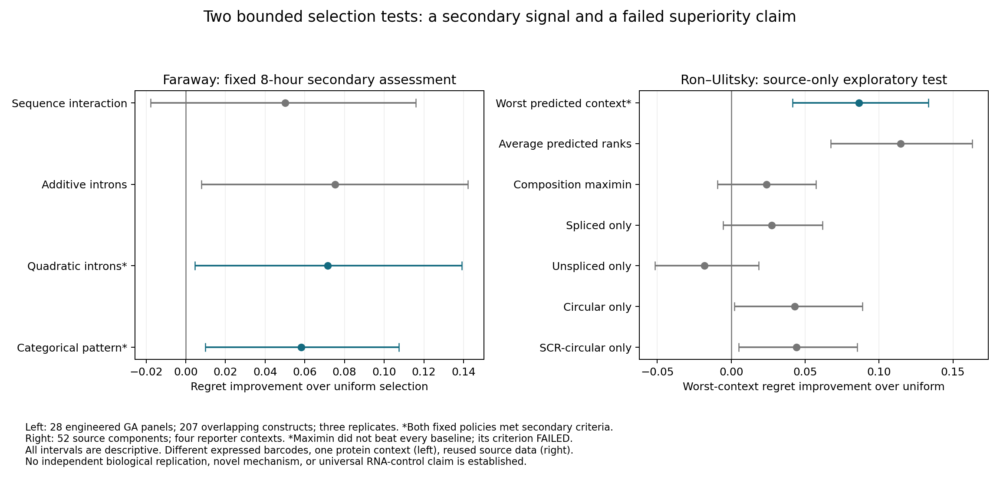

# Research checkpoint: configuration selection and context robustness

AI-authored computational research notes, 23 September 2026 local date.
These are analysis records, not student-authored competition prose. No money,
scheduled tasks, or external messages were used. The scientific goal remains
unfinished: there is a bounded secondary positive, but no established wholly
novel mechanism or general RNA-localization control method.

## 1. Project goal

Find a reproducible computational rule for selecting RNA-localization interventions,
with competitive controls, a useful effect, reliable data provenance, and a
specific contribution beyond prior work. Preserve failed tests rather than
optimizing the presentation around a desired positive result.

## 2. Complete versus in progress

### New Faraway results

The independent public library from [Faraway et al.](https://www.nature.com/articles/s41586-025-09568-w)
provided a new experiment outside the historical failed pipelines. Original
training used 206 synonymous GA patterns. The development set contained 25
other GA patterns and 26 eligible panels. Every choice set had four introns and
matched reconstructed exon sequence in the analyzed reporter insert.

**Interpretation correction:** different constructs carry different expressed
3′-UTR barcodes. The frozen specifications' phrase "identical designed mature
RNA" overstates what the 1,703-nt insert reconstruction establishes. Read
faraway_interpretation_addendum.md alongside those immutable specifications.
The encoded protein and reconstructed insert match within panels; complete
transcript identity, causal intron-position effects, and barcode independence
are not established. Intron identities and lengths also vary with position.

| Fixed model | Original development regret | Separate 8-hour regret | 8-hour gain over random | Descriptive 95% GA interval for gain |
|---|---:|---:|---:|---:|
| Sequence interaction | 0.43639 | 0.44996 | 0.05004 | [-0.01766, 0.11593] |
| Additive introns | 0.44187 | 0.42484 | 0.07516 | [0.00781, 0.14227] |
| Quadratic introns | 0.41780 | 0.42841 | 0.07159 | [0.00461, 0.13916] |
| Categorical intron pattern | 0.41928 | 0.44186 | 0.05814 | [0.00986, 0.10752] |
| Uniform choice | 0.50000 | 0.50000 | 0 | — |

Lower regret means a better choice among the tested candidates. The primary
sequence-interaction gate **failed**, because it did not beat the stronger
common-pattern controls. All original confirmation GA outcomes remain closed.
The development values and this verdict were preserved before the follow-up.

A separate secondary question was frozen in commit **1a82bc9** before reading
8-hour outcomes: would BOTH the unchanged quadratic and categorical policies
beat uniform choice by at least 0.05, with positive descriptive lower bounds
and positive gains in each replicate? **Both passed**, over 28 panels, 207
genotypes and all three replicate labels. Original model predictions were
reproduced to 1e-10 before this assessment. No model was tuned on 8-hour values.

All 207 target genotypes occur in the earlier experiment: 162 training and 45
development genotypes; none belong to reserved confirmation. Thus this is
repeat collection/time transfer within one study and protein context, not
generalization to new constructs. Of the 207 genotypes, 177 have one barcode,
25 have two and five have three. Barcode effects can persist across collections.

The post-hoc audit reproduced both original aggregate evaluations exactly.
The quadratic policy's 8-hour directional improvements over uniform choice
were 0.02889 and 0.06840 log2-ratio units for nuclear and cytoplasmic selection,
respectively. These are small effects, approximately 2% and 5% geometric ratio
changes in the desired directions, not 7% changes in biological localization.
Mean within-panel replicate Spearman correlations were 0.137–0.260 at 8 hours.
Selection using the other two measured replicates achieved regret 0.36302;
this is a repeatability diagnostic, not a formal ceiling.

A shared permutation of intron-pattern scores across all panels/replicates
gave one-sided Monte Carlo tail areas 0.01940 (quadratic) and 0.04679 (categorical).
These post-hoc diagnostics retain pattern dependence; they are not confirmatory
p-values and do not account for choosing the secondary hypothesis after development.

The author already studied intron density and individual intron-position effects;
see [official position-analysis code](https://github.com/ulelab/interstasis-paper/blob/a1b29411bd15e912e888d308c18678cd2c008a36/export_reporter/targeted_sequencing/piggybac_timecourse.r#L350).
The present decision benchmark is a possible methodological contribution to
investigate, not proof of novelty. Whole-transcript sequence-only impossibility
claims are specifically unsupported.

### Provenance progress

Publisher tables, author repository code, and official EBI metadata were used;
download receipts record URLs, bytes and SHA-256 hashes. The 17,623-byte
second-transfection script was additionally checked against the Git blob hash.
It was read as text, not executed. It explicitly names the two conditions 8 and
24 hours. Official E-MTAB-13329 metadata agrees; the workbook instead labels the
later condition 16 hr. This narrows the discrepancy to the public representations
but does not prove how the workbook was assembled. The later-condition outcomes
remain closed. The author code also filters on minimum counts across conditions,
so the published cohort is preselected using assay coverage beyond our 8-hour
subset. We have not reconstructed raw counts or the full barcode→genotype map.

### Four-context source-only test

The separately frozen experiment (**3fa0143**) asked whether selecting by the
weakest predicted context improves the weakest measured context. Five component
folds, alpha 100, all four contexts, all controls, eligibility and tie rules were
fixed before execution. Only the original 3,235 source rows were reused; 2,383
had all four measurements. Fifty-two components and 56 gene/library sets were
eligible. No original calibration, development or confirmation outcomes were used.

| Policy | Mean worst-context regret |
|---|---:|
| Average predicted percentile ranks | 0.37745 |
| Maximize weakest predicted percentile | 0.40564 |
| SCR-circular only | 0.44819 |
| Circular only | 0.44914 |
| Spliced only | 0.46478 |
| Composition maximin | 0.46817 |
| Uniform choice, computed exactly | 0.49218 |
| Unspliced only | 0.51024 |

The maximin policy improved over uniform choice by 0.08654, descriptive component
interval [0.04159, 0.13338], but its gain over averaging was -0.02819
[-0.06382, 0.00537]. Its all-comparator superiority criterion **failed**.
There is no reason from this test to add maximin complexity to the simpler rule.
The lower regret of averaging is an exploratory observation, not a promoted
confirmation result. The objective uses ranks rather than absolute localization.
Even where good candidates existed, the policies rarely found candidates in the
top quartile of all four contexts, so low average regret is not robust control.

Context dependence is established by [Ron and Ulitsky](https://www.nature.com/articles/s41467-022-30183-0).
Models targeting consistent localization in two cell lines also predate this work
([2022 neuronal reporter study](https://academic.oup.com/nar/article/50/18/10643/6717835)).
Maximin and averaging are established methods. Novelty remains unproven.

### Reproducibility and architecture

- faraway_metadata.py reads only construct/condition metadata. faraway_design.py
  reconstructs the insert, checks linked exon changes, and fixes GA partitions.
- faraway_configuration.py fits the four original models and enforces the
  failed primary gate. faraway_8h_replication.py reproduces fixed predictions
  and reads only its frozen 8-hour row whitelist.
- faraway_opened_audit.py verifies target insert identity, overlap, effect sizes,
  repeatability and shared-pattern randomization using already-opened rows only.
- context_robust_selection.py implements the bounded source-only comparison.
  faraway_context_figures.py plots saved metrics without fitting or label access.
- Older acquisition, pairing, feature extraction, FinalShot and Mechanism v2-v5
  modules remain preserved historical pipelines; their negative verdicts stand.

New results are local on **main**, with isolated research commits. Unrelated user
changes remain unstaged. The latest verification receipt records the scoped test
suite, all fourteen research freezes and the 228-file original source snapshot.
Safe legacy testing previously passed 113 tests; the historical preservation audit
still has the pre-existing analyze_finalshot_grouped_gates.py mismatch. We did not
change that file or run unfiltered pytest. All current experiments have finished;
no background experiment or scheduler remains running.

## 3. Next three tasks in order

1. Resolve construct-level provenance: locate the public barcode→genotype mapping
   and raw/processed correspondence for the opened Faraway rows, while retaining
   the count-selection and time-label caveats. Stop this route if identifiers
   cannot be independently reconciled; more model searches will not fix provenance.
2. Identify one genuinely independent, compatible validation cohort using metadata
   first. Freeze a small set of practical selection rules and competitive controls
   before access. Existing reserved sets are not available to rescue failed gates.
3. Build a concise, reproducible benchmark contribution with the strongest bounded
   positive and all failed comparisons visible. Complete a claim-by-claim prior-art
   table and have the student independently reproduce and interpret the analysis.
   Independent validation and a specific novelty claim are still needed.

## 4. Explicit do-not-touch list

- Astrocyte local sequences, features, labels, outcomes and downstream artifacts;
  N-zip outcomes; quarantined TDP EV5 stability.
- Historical FinalShot and Mechanism v2-v5 freezes, splits, representations,
  caches and negative verdicts; no v6 recycling of the same tests.
- Arora replicates 3/4; SIRLOIN NucLibC replicates 3/4 and all NucLibB outcomes.
- Original context-calibration confirmation groups and unused calibration labels.
- Shukla Nuclei4–6/Total4–6 and reserved raw runs; unadmitted mutREL/speckle outcomes.
- All original Faraway confirmation GA outcomes across assays; transfection_2
  later-condition outcomes; dox, CLK and stability outcomes. The secondary pass
  grants no new access.
- Every hashed experiment freeze and its files. Corrections use additive records.
- Unrelated user edits, paid services/purchases, scheduled tasks and external messages.

## 5. Confidence gaps and decisions

The positive Faraway result is small, uses overlapping constructs and distinct
expressed barcodes, and lacks independent raw reconstruction. It does not establish
a mechanism, new algorithm, cross-gene transfer, or STS finalist-level novelty.
The robust-context diagnostic does not improve on its strongest simple comparator.
The original project remains in progress; no user permission is needed for the
already-authorized free computational steps.

A broad web search returned an unsolicited published aggregate excerpt from the
sealed Astrocyte study. No local protected data were opened and the excerpt was
not used, but perfect ignorance of its published aggregate findings cannot be
claimed. See literature_scope_note_20260923.md for the access record. Any future
formal confirmation audit must account for it.

DONE — this five-section checkpoint is complete; the broader research goal is not.
